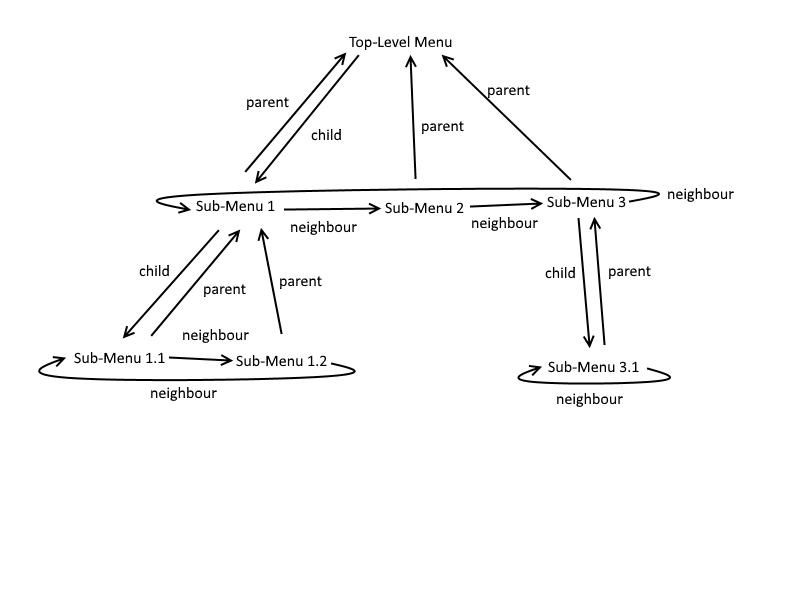
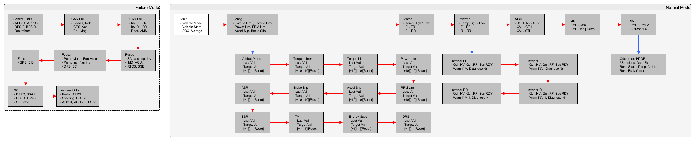

# Driver Information System Saison 18/19

Hier kann die Implementation des DIS für die Saison 18/19 gefunden werden. 

## Zielstellung
Grundsätzlich soll...

* mindestens die Funktionalität des DIS aus der letztes Saison bestehen bleiben.
* ausführliches Refactoring vorgenommen- & die Menüführung deutlich strukturierter und einfacher gestalten werden.
* es leicht sein, die Reihenfolge der Menüs zu vertauschen, deren Struktur umzustellen oder diese beliebig zu verschachteln.
* ein "Push"-System entwickelt werden, mit dem am Ende wichtige Ereignisse (Fehler, Grenzwertüberschreitungen etc.) direkt sichtbar gemacht werden.
* verschiedene Parameter von dem DIS aus anpassbar sein.

## Steuerung

| Button | HIL         | Bedeutung           | Funktion                                           |
|--------|-------------|---------------------|----------------------------------------------------|
| LR1    | REL_LOW_11  | Select              | Geht zum nächsten Untermenü.                       |
| LR2    | REL_LOW_12  | Next                | Geht zum nächsten Nachbarmenü.                     |
| LR3    | REL_LOW_13  | Return              | Geht zum Parentmenü.                               |
| LR4    | REL_LOW_14  | --                  | Dekrementiert den Wert (nur in einem Config-Menü). |
| LR5    | REL_LOW_15  | ++                  | Inkrementiert den Wert (nur in einem Config-Menü). |
| LR6    | REL_LOW_19  | Toggle Failure Mode | Zeigt (wenn gedrückt) alle aktuellen Fehler an.    |

## Menüführung
### Grundidee
Die Menüs sind folgen einer Baumstruktur. Jedes Menü hat eine Referenz auf das 
erste Untermenü, auf seinen Nachbarn (Menüs der gleichen Rangordnung) und auf das Obermenü. Sonderfälle, z.B. dass kein Untermenü, Nachbar oder Obermenü vorhanden ist, werden entsprechend behandelt. Zur Navigation gibt es auf dem Lenkrad drei Tasten, mit denen jeweils entweder einen Nachbar weitergeschalten ("next"), einen Menüebene tiefer betreteten ("enter") oder wieder eine Menüebene nach oben gegangen werden kann ("return"). 

Dazu wird ein einfacher Pointer genutzt, der immer das aktuelle Menü anzeigt und mit entsprechenden Operationen 
manipuliert werden kann, also dann z.B. auf den Nachbarn oder das Untermenü zeigt. Die "äußersten" Menüs, also die, die als letztes hinzugefügt worden sind, zeigen mit ihrem Nachbarzeiger immer auf das erste Untermenü des Obermenüs, wodurch man durch die Menüs "durchrotieren" kann.

### Implementierung

## Fehler
Fehler werden angezeigt, wenn der Toggle-Failure-Mode Button gedrückt gehalten wird. Dabei rotiert die Fehleransicht durch alle möglichen Fehler durch (für Reihenfolge siehe Bild oben). Loslassen springt wieder zu dem Menü zurück, von dem man hergekommen ist.

## LEDs
| LED   | Const                                      | Blink                                      |
|-------|--------------------------------------------|--------------------------------------------|
| VCU   | AMS == "Drive" && Vehicle State == "Drive" | AMS == "Drive" && Vehicle State != "Error" |
| Drive | Vehicle State == "Error"                   | -                                          |
| Reku  | Reku aktiv                                 | -                                          |